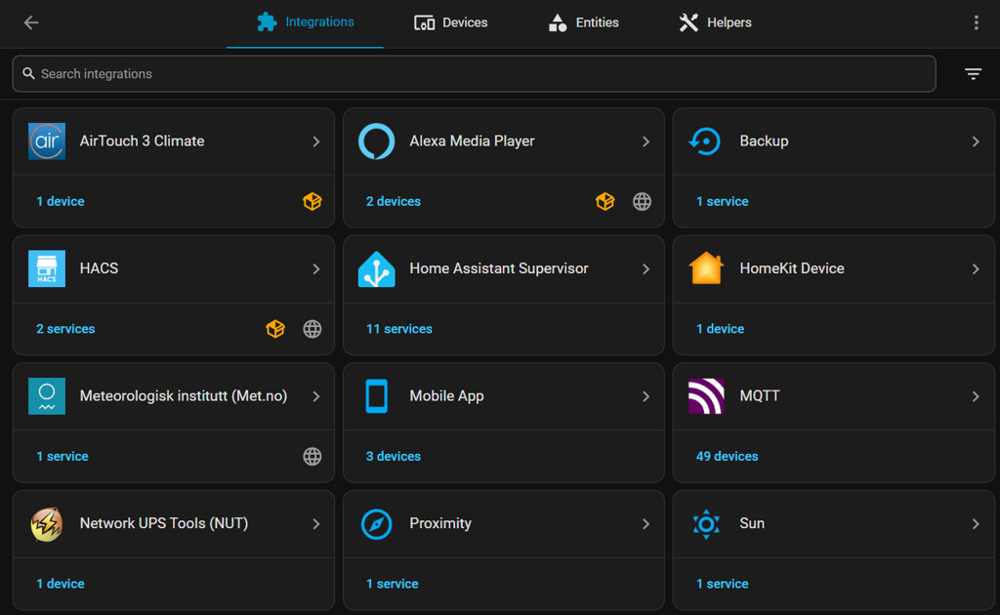
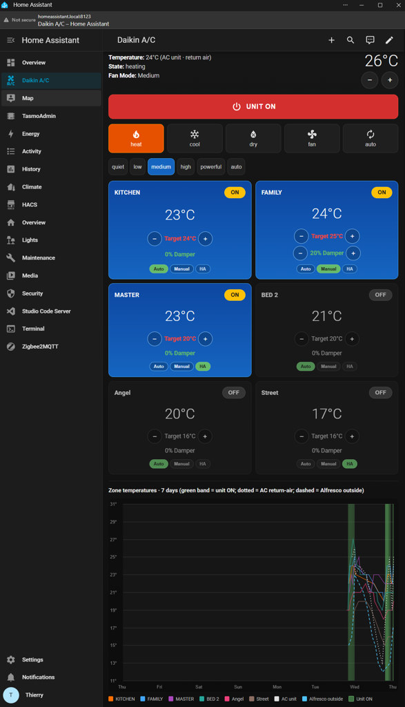

# AirTouch 3 — native Home Assistant integration

> **If like me you have an aging AirTouch 3 and regret not having an AirTouch 4/5 to enable integration with your Home Assistant, now is your chance to make this capability a reality at $ zero cost and in a couple of hours or less!!!**

[](https://github.com/ThierryBrunet/airtouch3-native-homeassistant)

Local-control integration for **Polyaire AirTouch 3** ducted zone controllers (common with **Daikin** indoor units). Talks directly to the wall controller on TCP port **8899** — no `vzduch-dotek` .NET API, no cloud.

See [NOTES.md](NOTES.md) for design rationale, Faikin alternative, ozczecho credit, and Grok Build provenance.

**100% AI-driven installation** — see [docs/INSTALLATION-GUIDE.md](docs/INSTALLATION-GUIDE.md) for an exciting journey into AI-driven Home Assistant (Grok Build prompts **or** step-by-step manual path).



### Built with Grok Build in 12 hours

This entire project — integration, dashboard card, live HA UI, automations, helpers, deploy scripts, and **all documentation (including this README)** — was produced **entirely by Grok Build TUI** via the Home Assistant **MCP** server (`ha-mcp`). The home owner did **not** write or edit a single line of code or YAML by hand.

From the decision to port ozczecho’s .NET `vzduch-dotek` stack to native Python, to a working production system on Home Assistant: **12 hours** (Grok Build 0.2.54 / Composer 2.5 Fast, 16 June 2026). An outstanding example of **Grok Build’s phenomenal capabilities** for home automation.

**Full installation (AI or manual):** [docs/INSTALLATION-GUIDE.md](docs/INSTALLATION-GUIDE.md) · **HA MCP setup:** [docs/grok-build-home-assistant-mcp.md](docs/grok-build-home-assistant-mcp.md)



---

## What you get

| Layer | Description |
|-------|-------------|
| **Integration** | `climate.*`, `switch.*` (zones), `fan.*` (dampers), `sensor.*` (ITC temperatures) |
| **Custom card** | `daikin-ac-panel` — unit power, HVAC modes, fan speed, zone controls, 7-day charts |
| **Optional** | Template helper for unit power (chart overlay), morning-start automation |

---

## Grok Build + Home Assistant MCP (developers)

To **extend this project** the same way it was originally built — agent-driven integration, dashboard, automations, and docs over MCP — see the full guide: **[docs/grok-build-home-assistant-mcp.md](docs/grok-build-home-assistant-mcp.md)**.

Summary:

1. Install **Grok Build** and **`uv`** (provides `uvx` for `ha-mcp@latest`).
2. Create a Home Assistant **long-lived access token** (profile → Security).
3. **Install/configure** the MCP server in Grok Build — `grok mcp add --scope project home-assistant …` or project `.grok/config.toml` with `HOMEASSISTANT_URL` + `${HOMEASSISTANT_TOKEN}`.
4. Load env vars, start `grok`, verify with `grok mcp doctor home-assistant`; in TUI use `/mcps` → enable **home-assistant** → refresh.
5. Optionally add **GitHub MCP** (`https://api.githubcopilot.com/mcp/`) to create or push public forks.

---

## TIP — let Grok Build do the work

**You do not need to follow every step below by hand.** [Grok Build](https://github.com/xai-org/grok) is exceptionally capable at Home Assistant work when connected via the [Home Assistant MCP](docs/grok-build-home-assistant-mcp.md). This entire project was built that way — in 12 hours, with zero manual code or YAML.

Instead of copying commands from this README, open Grok Build and **describe what you want in plain English**. Grok will read your live HA instance, clone repos, deploy files, wire dashboards, and tune automations for you.

**Try prompts like these** (copy, tweak names/IPs, send):

> Install and configure the Home Assistant MCP server for Grok Build on this machine.

> Clone [airtouch3-native-homeassistant](https://github.com/ThierryBrunet/airtouch3-native-homeassistant) into my workspace and deploy the full integration and dashboard card to my Home Assistant at `192.168.x.x`.

> Set up the Daikin A/C dashboard from this repo — add the Lovelace resource, create the panel view, and map my zone entities.

> On the dashboard, change the **FAMILY** zone card color from blue to pink.

> Add an automation: turn off the AC unit at **9:00 PM on weekdays** and **11:00 PM on weekends**.

> Create a morning automation — start the unit at 6 AM, or earlier if motion is detected between 4 and 6 AM, with fan on High.

Grok Build figures out the Samba paths, entity IDs, YAML, restarts, and verification. The manual instructions below are still here if you prefer a hands-on install — or if you want to see exactly what Grok did under the hood.

### TIP — manage secrets securely

This project needs a few credentials: Home Assistant URL and long-lived token (for `ha-mcp`), Samba or SSH access for deploy, and optionally a GitHub PAT. **Do not paste them into chat, commit them to git, or hard-code them in `.grok/config.toml`.**

Ask Grok Build to wire up secret handling for you. On Windows, the author uses **[PowerShell SecretStore](https://learn.microsoft.com/en-us/powershell/utility-modules/secretmanagement/overview)** (`Microsoft.PowerShell.SecretStore`) — secrets stay encrypted on disk and load into environment variables before `grok` starts. You may prefer something else: **1Password CLI**, **macOS Keychain**, **Windows Credential Manager**, **Bitwarden**, or plain **shell env vars** in a local-only profile script.

**Try prompts like these:**

> Set up secure credential storage for this AirTouch project: Home Assistant MCP token and URL, Samba deploy credentials, and GitHub PAT. Use PowerShell SecretStore on my Windows PC — never print secret values in chat or commit them to the repo.

> Create a `Load-McpSecrets.ps1` beside `.grok/config.toml` that loads `HOMEASSISTANT_URL`, `HOMEASSISTANT_TOKEN`, and `GITHUB_PERSONAL_ACCESS_TOKEN` from my vault, then document how to dot-source it before starting Grok.

> Audit this workspace for leaked tokens — config files, scripts, and git history should reference `${ENV_VAR}` placeholders only.

Reference implementation: `GrokBuild/.grok/Load-McpSecrets.ps1` and [docs/grok-build-home-assistant-mcp.md](docs/grok-build-home-assistant-mcp.md).

---

## Prerequisites (home owner install)

- Home Assistant **2024.1+** (tested on 2026.6.x)
- AirTouch 3 controller reachable on your LAN (default TCP **8899**)
- Access to the HA `config` folder (Samba, SSH, Studio Code Server, or file editor add-on)
- **Recorder** enabled (for temperature/damper history charts in the custom card)

Find the controller IP from your router, the AirTouch app, or scan port 8899 on your subnet (see [Validate connectivity](#4-validate-connectivity-optional)).

---

## 1. Build / obtain the files

Clone or copy this repository. The integration source lives in `airtouch3_custom_component/`:

```
airtouch3-native-homeassistant/
├── airtouch3_custom_component/    ← copy contents to HA custom_components/airtouch3
│   ├── __init__.py
│   ├── climate.py
│   ├── protocol/
│   ├── www/
│   │   └── daikin-ac-panel-v11.js
│   └── ...
├── scripts/
│   └── Deploy-AirTouch3Component.ps1
└── docs/
```

There is no compile step — Python and JavaScript are deployed as-is.

---

## 2. Deploy the integration to Home Assistant

### Option A — Windows + Samba (recommended if you use a share)

From PowerShell, adjust `-SambaHost` to your HA IP or hostname:

```powershell
cd C:\path\to\airtouch3-native-homeassistant\scripts
.\Deploy-AirTouch3Component.ps1 -SambaHost 192.168.1.100
```

This copies:

- `airtouch3_custom_component/*` → `\\<host>\config\custom_components\airtouch3\`
- `www/daikin-ac-panel-v*.js` → `\\<host>\config\www\`

### Option B — Manual copy (any OS)

1. Copy the folder `airtouch3_custom_component/` to your HA config directory as:

   ```
   config/custom_components/airtouch3/
   ```

   Include all `.py` files, `manifest.json`, `translations/`, `services.yaml`, and `protocol/`.

2. Copy the dashboard card (latest version):

   ```
   airtouch3_custom_component/www/daikin-ac-panel-v11.js
   → config/www/daikin-ac-panel-v11.js
   ```

3. **Do not** copy `__pycache__/`, `.git/`, or `at3.PNG`.

### After deploy — restart Home Assistant

**Settings → System → Restart** (full restart).

> Avoid **Reload AirTouch 3** from the integrations UI after Python changes; use a full restart instead.

---

## 3. Add the integration (UI)

1. **Settings → Devices & services → Add integration**
2. Search for **AirTouch 3**
3. Enter:
   - **Host** — IP of the AirTouch wall controller (e.g. `192.168.31.144`)
   - **Port** — `8899` (default)
4. Submit. On success you should see one climate entity and entities per zone.

### Entities created

Names come from your AirTouch zone labels (slugified by Home Assistant):

| Type | Example | Notes |
|------|---------|--------|
| Climate | `climate.brunet` | Main AC unit (name from AirTouch) |
| Zone switch | `switch.kitchen` | Zone on/off |
| Zone fan | `fan.kitchen` | Damper % (`percentage` attribute) |
| Temperature | `sensor.airtouch3_90681913_2` | Pattern: `sensor.airtouch3_<airtouch_id>_<sensor_id>` |

**Important:** Note your actual `entity_id` values under **Developer tools → States** before configuring the dashboard. They vary by unit name and sensor layout.

### Map zones to temperature sensors

Each zone may use the touchpad or an ITC sensor. For the dashboard charts, match each zone to the sensor entity that reports that room’s temperature. In a typical 6-zone Daikin install, sensor IDs are often **0, 2, 4, 6, 8, 10** (even numbers) — confirm in **States**.

---

## 4. Validate connectivity (optional)

**Windows** — test TCP to the panel:

```powershell
.\scripts\Test-AirTouchConnection.ps1 -Host 192.168.31.144 -Port 8899
```

**Python** — protocol smoke test (from repo root):

```bash
python scripts/validate_airtouch_protocol.py --host 192.168.31.144 --port 8899
```

---

## 5. Dashboard UI — Lovelace resource

The custom card must be registered before use.

1. **Settings → Dashboards → ⋮ (top right) → Resources**
2. **Add resource**
   - URL: `/local/daikin-ac-panel-v11.js`
   - Type: **JavaScript module**
3. Save, then hard-refresh the browser (**Ctrl+Shift+R**) on any dashboard tab.

If you deploy a newer `v12` file later, add or update the resource URL to match.

---

## 6. Dashboard UI — create the panel view

### Option A — UI editor (storage mode)

1. **Settings → Dashboards → Add dashboard** (or open an existing one)
2. Create a new view:
   - Title: `Daikin A/C`
   - URL path: `daikin-ac` (example)
   - **Panel mode** (recommended — full-width card)
   - Theme: e.g. `midnight` (optional)
3. **Add card → Manual** (or “Custom card” if offered)
4. Paste the YAML from [docs/dashboard-daikin-ac.example.yaml](docs/dashboard-daikin-ac.example.yaml), then **replace every `entity_id`** with yours from step 3.
5. Save.

### Option B — YAML mode

If your dashboard is YAML-managed, merge the example file into your Lovelace config and adjust entity IDs.

### Card configuration fields

| Field | Description |
|-------|-------------|
| `climate` | Main `climate.*` entity |
| `zones[].name` | Display label (any text) |
| `zones[].switch` | Zone `switch.*` |
| `zones[].fan` | Zone `fan.*` (damper) |
| `zones[].sensor` | Zone temperature `sensor.*` (for live temp + charts) |

The card includes **7-day** temperature and damper history charts. Charts need **recorder** history for the sensor and fan entities, plus the power helper below.

---

## 7. Optional — unit power helper (for chart green bands)

The panel overlays **unit ON** periods using `binary_sensor.brunet_ac_power` (hardcoded in `daikin-ac-panel-v11.js`). Create a matching template binary sensor, **or** edit that line in the JS if your climate entity has a different name.

### UI: Template helper

1. **Settings → Devices & services → Helpers → Create helper → Template → Binary sensor**
2. Name: **Brunet AC Power** (slug → `binary_sensor.brunet_ac_power` if your climate is `climate.brunet`)
3. State template (adjust climate entity):

   ```jinja2
   {{ state_attr('climate.brunet', 'ac_power') }}
   ```

4. Icon: `mdi:power`
5. Save

If your climate entity is not `climate.brunet`, either rename the helper to match what the JS expects (`binary_sensor.<slug>_ac_power`) or change `_powerEntity` in `daikin-ac-panel-v11.js` and redeploy to `www/`.

---

## 8. Optional — morning-start automation

Example: turn on AC at **06:00**, or earlier (**04:00–06:00**) on living-room motion, and set fan to **High**.

See [docs/automation-morning-start.example.yaml](docs/automation-morning-start.example.yaml). Create via **Settings → Automations → Create → Edit in YAML**, replacing:

- `climate.brunet`
- `binary_sensor.brunet_ac_power`
- `binary_sensor.aqara_motion5_occupancy` (your motion entity)

---

## 9. Updating

1. Pull/copy new files to `custom_components/airtouch3` and `www/`
2. **Restart Home Assistant**
3. Update the Lovelace **resource** URL if the card filename changed (`v11` → `v12`, etc.)
4. Hard-refresh the browser

Bump version in `manifest.json` when you fork or release.

---

## Troubleshooting

| Symptom | Check |
|---------|--------|
| Integration won’t connect | Ping host; port **8899** open; correct IP (wall controller, not indoor unit) |
| No entities after setup | Full HA **restart**; logs **Settings → System → Logs**, filter `airtouch3` |
| Custom card blank | Resource added as **module**; file under `config/www/`; Ctrl+Shift+R |
| Charts empty | Recorder running long enough; sensor/fan entities have history |
| `reload` integration errors | Use full restart instead of reload |
| Zone names wrong | Trimmed names from AirTouch (e.g. `BED 2   `) — rename in **Settings → Entities** |

---

## Repository layout

| Path | Purpose |
|------|---------|
| `airtouch3_custom_component/` | HA custom integration + `www/` card |
| `scripts/Deploy-AirTouch3Component.ps1` | Samba deploy to HA |
| `scripts/validate_airtouch_protocol.py` | Protocol validation |
| `docs/` | Screenshot, example YAML, Grok Build MCP guide |
| `docs/INSTALLATION-GUIDE.md` | Full install — Option A (Grok Build prompts) or Option B (manual) |
| `docs/grok-build-home-assistant-mcp.md` | Install/configure HA MCP (and optional GitHub MCP) for Grok Build |
| `NOTES.md` | Design notes, alternatives, credits, 12-hour Grok Build story |

---

## Credits

Protocol and original HA work: **[ozczecho](https://github.com/ozczecho)** — [vzduch-dotek](https://github.com/ozczecho/vzduch-dotek), [airtouch3_custom_component](https://github.com/ozczecho/airtouch3_custom_component). See [NOTES.md](NOTES.md).

## License

MIT (consistent with upstream vzduch-dotek). Attribution retained.